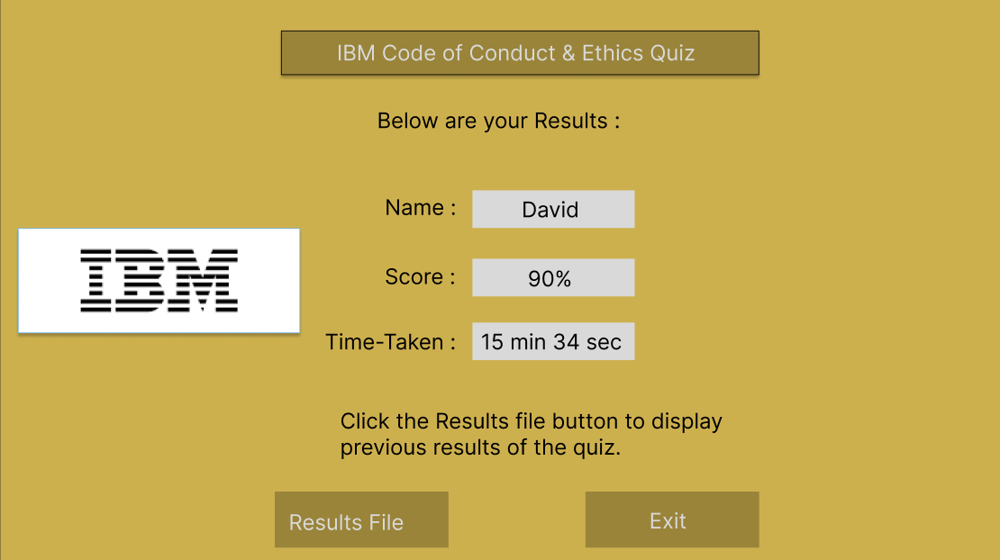

# IBM Code of Conduct & Ethics Quiz

---

## Introduction

### Organisational Context

IBM is an American‑founded technology company founded in 1911. It is a leading provider of software and services in hybrid cloud, artificial intelligence, and enterprise and strategic consulting services. IBM places a strong emphasis on ethical conduct, compliance, and professional responsibility. To support this, IBM maintains a comprehensive Code of Conduct and a set of ethical guidelines that govern employee behaviour, decision‑making, and interactions with clients, partners, and colleagues.

---

### Project Overview

This project develops an **IBM Code of Conduct & Ethics Quiz**, designed for internal use at IBM. The aim of the application is to provide IBMers with an accessible and interactive way to reinforce their understanding of IBM’s ethical standards, including topics such as conflicts of interest, data confidentiality, responsible use of technology, and reporting unethical behaviour.

The application allows users to answer multiple‑choice questions, receive immediate feedback on their performance, and have results securely stored for review or export. In terms of relevance, by testing knowledge through a structured quiz, the application supports ongoing compliance awareness and helps promote a consistent ethical culture across the organisation.

---

### Technical and Non‑Technical Perspective

From a non‑technical standpoint, the application effectively highlights how software solutions can be used to support ethical considerations, governance, and professional standards within a large enterprise.

From a technical standpoint, the application follows a professional development lifecycle. It is designed, built iteratively, tested, deployed, and documented. The project is developed in **Python** and uses a graphical user interface created via the **Tkinter** library. Additionally, the application incorporates object‑oriented principles, alongside automated testing and continuous integration.

## Design Section

### GUI Design 

The graphical user interface (GUI) has been designed to provide a clear and accessible user experience for IBM employees. It  prioritises simplicity, clarity, and ease of navigation while also maintaining a professional appearance appropriate for an enterprise environment.

Figam GUI Design Link - https://www.figma.com/design/jSgJQLkl1BMuzE6WGKZbGs/Quiz_App?node-id=0-1&p=f&t=8du06XqQwQSVRu5d-0

The application follows a linear user journey consisting of four primary screens:

- **Welcome Screen**
  - Displays application title and welcome message.
  - Provides users with options to start the quiz by entering a username and submitting, or to exit the application via the exit button.

- **Quiz Screen**

  - Displays a multiple‑choice question follwed by the question number at a time.
  - Uses radio buttons for answer selection.
  - Prevents submission unless an answer is selected.
  - Provides a **Submit** button to confirm the selected answer.
  - Includes a **Next** button that changes the question. Otherwise, it remains inactive until submission.

**Answer / Feedback**

- Provides immediate visual feedback indicating whether the selected answer is correct or incorrect.
- Ensures feedback is shown before users can continue, reinforcing learning outcomes.

- **Results Screen**

  - Displays the outcome of the completed quiz.
  - Acts as the final stage of the quiz user journey.

  - **Current Results View**
    - Displays the user’s name entered at the start of the quiz.
    - Shows the user’s final score - percentage  of correct answers.
    - Displays the total time taken to complete the quiz.
    - Ensures results are presented in a clear and readable format.
    - Includes a button to access stored quiz results or to exit the application.

    

  - **Stored Results View**
    - Displays when the user selects the **Results_File** button.
    - Loads and presents previously stored quiz results from CSV file.
    - Shows historical data such as user names, scores, completion dates and times.
    - Allows users or administrators to review past quiz attempts.

    

### Functional Requirements

- The application must provide a welcome interface that allows users to start the quiz or exit the application.
- The application must allow users to enter their name prior to starting the quiz.
- The application must present ethics‑based multiple‑choice questions related to IBM’s Code of Conduct.
- The application must display one question at a time during the quiz.

- **Question Handling**

  - The system must present a dedicated **Question Screen** where users can select a single answer using radio buttons.
  - The system must prevent users from submitting a question unless an answer has been selected.
  - The system must record the user’s selected answer upon submission.

- **Answer/Feedback**

  - The system must indicate whether the selected answer is correct or incorrect, after submission.
  - The system must display feedback before allowing the user to proceed to the next question.
  - The system must allow users to navigate sequentially through the quiz using a *Next* button.

- **Results Handling**

  - The system must display a **Results Screen** upon quiz completion.
  - The Results Screen must show the user’s name, final score, and total time taken to complete the quiz.
  - The system must store quiz results in persistent storage.
  - The system must provide a *Results File* button to allow users to view previously stored quiz results.
  - The system must load and display past quiz results data when the *Results File* button is selected.

- **Data Management**

  - The system must read quiz questions from a persistent data source, CSV file.
  - The system must handle missing or invalid data without crashing.

---

### Non‑Functional Requirements

- The application must be easy to use for all types of employees.
- The user interface must be clear, consistent, and professionally styled for internal IBM use.
- The system must provide meaningful feedback and error messages where appropriate.
- The application must perform reliably across multiple quiz attempts.
- The application must be maintainable and modular to support future enhancements.
- The application must support testing by separating quiz logic from the graphical interface.
``

